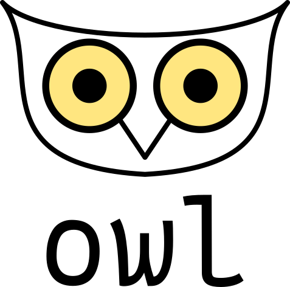

# Owl

**⚠️ This library is under development**

Owl is a Go library to create project generators for any framework or language. This is a personal project that you can use.
There is no warranty if you have an error or bug publish an issue or make a pull request to improve this library.

<div align="center">
    
</div>

## Features

Owl is a template based library, what it means? It copy a template and then run init scripts that resides in
that template.

- [x] Config file can be writed in json, yaml, toml thanks to [Viper](https://github.com/spf13/viper)
- [x] Copy a local template
- [x] Run preconfigured template scripts
- [ ] Ignore specific files with .owlignore file
- [ ] Copy a remote template

## Installation
```shell
go get -u github.com/4strodev/owl@latest
```

## Example of use

Go main file
```go
package main

import (
	"flag"
	"fmt"
	"os"
	"path"

	"github.com/4strodev/owl"
	"github.com/4strodev/owl/template"
)

// This variables save the project configuration
var (
	projectName     string
	moduleName      string
	projectTemplate string
	verboseOutput   bool
)

func main() {
	flag.StringVar(&projectName, "name", "my-app", "-name <project name>")
	flag.StringVar(&projectTemplate, "template", "go-cli", "-template <project template>")
	flag.StringVar(&moduleName, "module", "", "-template <project template>")
	flag.BoolVar(&verboseOutput, "verbose", false, "-verbose")
	flag.Parse()

	if moduleName == "" {
		fmt.Printf("Set go module name: ")
		fmt.Scanln(&moduleName)
	}

	project := owl.NewProject(
		owl.ProjectConfig{
			Name:         projectName,
			TemplateName: projectTemplate,
			LocalTemplatesDirs: []string{
                // Searching templates in ~/Templates folder
				path.Join(os.Getenv("HOME"), "Templates"),
			},
			VerboseOutput: verboseOutput,
		}, template.TemplateConfig{
			ConfigType: "toml",
            // Can send variables to the template this is useful when making scripts
			Context: map[string]any{
				"ModuleName": moduleName,
			},
		},
	)

	err := project.Create()
	if err != nil {
		switch err.Error() {
		case owl.DIR_EXISTS:
			fmt.Printf("Folder %s already exists\n", projectName)
		case owl.TEMPLATE_NOT_FOUND:
			fmt.Printf("Template '%s' not found\n", project.Config.TemplateName)
		default:
			fmt.Printf("Error creating project: %s\n", err)
		}
		os.Exit(1)
	}
}
```

See [`example_template/go-cli`](https://github.com/4strodev/owl/tree/main/example_template/go-cli) to know how to create a template.

## TODO
- [ ] Doc page (in progress)

## Thanks to
[@spf13](https://github.com/spf13)
