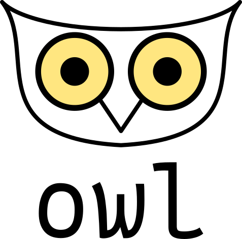

# Owl

**⚠️ This library is under development**

Owl is an language agnostic library to create project creators. This is a personal project that you can use.
There is no warranty if you have an error or bug publish an issue or make a pull request to improve this library.

    

## Features

Owl is a template based library what it means. It copy a template and then run init scripts that resides int
that template. For example in a go project you have start files but the project name have to be set with a command.

- [x] Copy a local template
- [ ] Run preconfigured template scripts
- [ ] Ignore specific files with .owlignore file
- [ ] Copy a remote template
